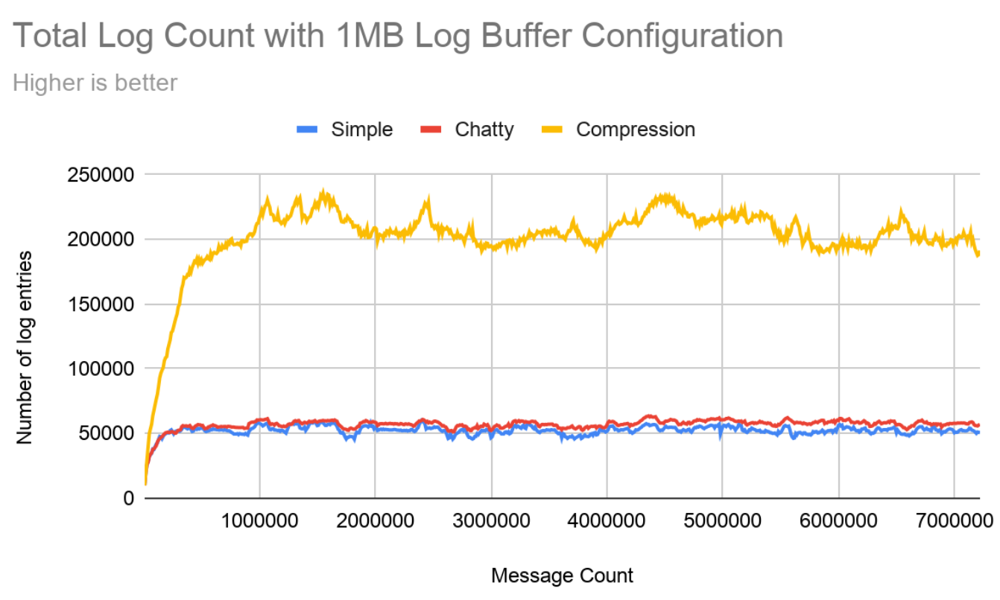
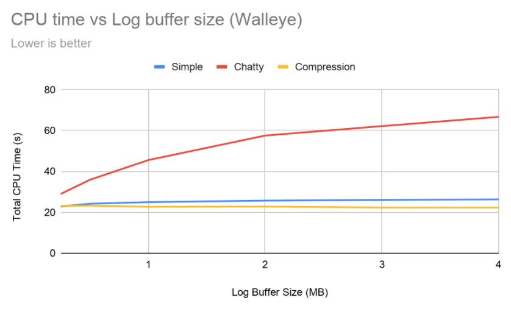
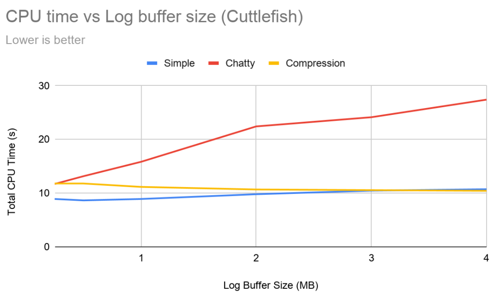
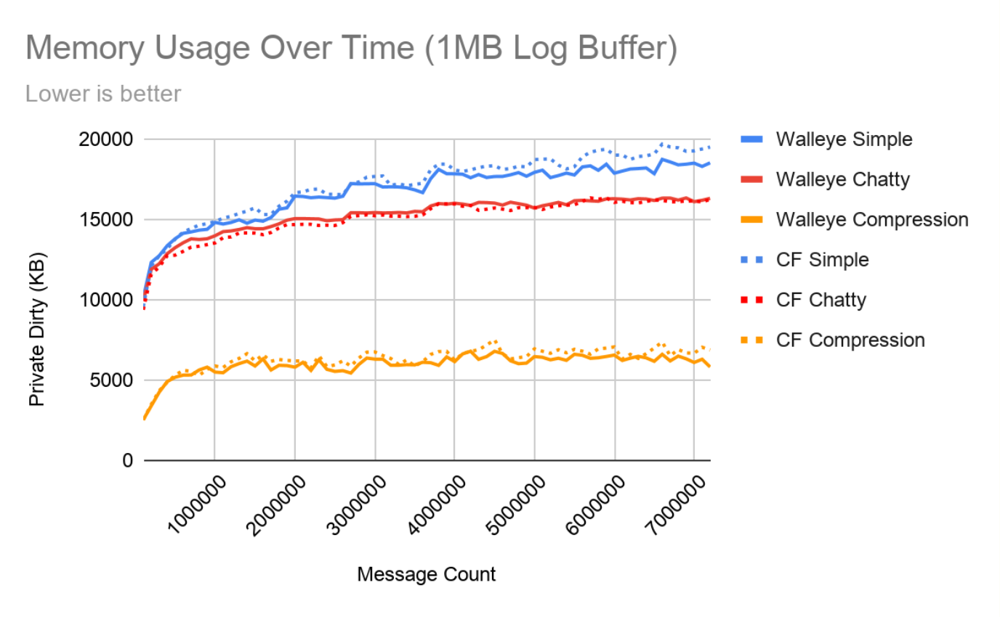

# Log Compression instead of Chatty in Android S

## The problem

* Log buffer space is precious, but suffers from the tragedy of the commons
* Log spam fills the buffers making them less useful in logcat/bugreports
* “Spam” is often in the eye of the beholder: which messages are important depends on what you’re trying to debug

## The idea

* Chatty isn’t helping as much as we’d hoped, and is surprisingly expensive
* Compress logs to make more efficient use of the buffer
* Address the root cause of log spam at its source:
    * Do not hide log spam at runtime, which de-incentivize fixes
    * Add presubmit coverage similar to SELinux violations to keep log spam down

---

## Chatty in Theory

* Delete messages classified as spam to extend the range of logs from other sources
* “Spam” defined as:
    * Logs from UIDs whose logs consume over 12.5% of a log buffer
    * Back-to-back exact duplicate messages

## Chatty in Practice

* Developer confusion about missing and de-duplicated logs
* Lowered incentive to fix the root cause of bad logging behavior
* High CPU overhead
* Memory usage greatly exceeds configured buffer size
* Only marginal increase in log range

---

## Log Compression in Theory

* Store many more logs in the same log buffer size => better for diagnosis
* Memory usage stays below configured log size => better system health
* No gaps in logs, no de-duplicated logs => no developer confusion
* No hiding bad behavior => increased accountability/incentive to fix root causes

## Log Compression Preliminary Results

* Captured 2, 5 day periods of full time personal usage of Pixel 4 and replayed the logs offline
* Compression vs Chatty:
    * **3.5x more log messages on average**
    * **50% less CPU usage**
    * **50% less memory usage**

---

## Log Messages in 1MB

* The number of log messages still available in logcat after ‘Message Count’ messages have been logged to a 1MB log buffer
* Note: ‘Simple’ is the Chatty code without log spam detection and without de-duplication.

---

## CPU Time

* Total CPU time on ARM64 (Walleye) and 32bit x86 (Cuttlefish)
* X axis represents different log buffer size configurations.
    * Chatty uses significantly more CPU time at 1MB (the default Pixel configuration)
    * Chatty scales poorly with increased log buffer sizes
* Note: “simple” isn’t “compression without actually compressing”, it’s “chatty without doing the chatty elimination”, which is why “simple” is more expensive than “compression” on walleye.

---

## Memory Usage

* The memory used by ‘Message Count’ messages, on both Walleye and Cuttlefish
* Note: Chatty does not consider the metadata (UID, PID, timestamp, etc) in its calculation of log buffer size, so a 1MB log buffer will consume more than 1MB.  Note that there are 8 log buffers, 5 of which are typically filled.

